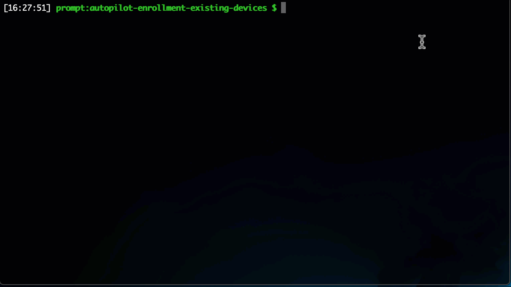

# Windows Autopilot Enrollment for Existing Devices
## Introduction
Current Windows Autopilot enrollment options require either the OEM to preregister new devices in your Microsoft Business Store or push a script to an existing device (using SCCM, etc.), then pull the resulting CSV to manually enroll the system into Autopilot. But what about existing systems that are geographically seperated, not Azure AD enrolled, not VPN'd into a network, or centrally managed? This project allows an administrator to push a short Powershell script to a remote system and send its results to a Internet facing web API. This "push" can be done through third-party software like Team Viewer, LogMeIn or simply have the remote user run the script as an Administrator.

### Information gathered
- Hostname
- External IP address
- Hardware serial number
- Hardware make and model
- Hardware hash
- Timestamp of execution

### Components
- `autopilot-enrollment-existing-devices` Nodejs web API
- `Host Scripts\get-apinfoexisting.ps1` Powershell script for remote system

### Requirements (Web API)
- Internet facing system (e.g. AWS, Azure, self-hosted)
- Nodejs
- DNS record for web API (more for convenience)

## Requirements (Remote Host)
- a running web API
- administrator privileges
- Powershell 3.0
- connection to the Internet
- ability to execute the script remotely

## Installation (Web API)
1. Download nodejs [https://nodejs.org/en/download/](https://nodejs.org/en/download/) and install
2. Run the following:

```
git clone https://github.com/jknyght9/autopilot-enrollment-existing-devices
cd autopilot-enrollment-existing-devices
npm install
npm start
```



## Notes regarding the Web API
- The API runs on port 8000
- HIGHLY recommend using a load balancer with an SSL/TLS certificate to encrypt all the traffic. Otherwise this data will transmitted in CLEAR TEXT. **You are responsible for any data leakage that may occur.**
- Ensure that your host firewall allows TCP port 8000
- Ensure that your network/enterprise firewall allows TCO port 8000 to the server hosing this web API
- Web server logs (access and error) are located in the `log` folder
- Host registration information is located in the `data` folder

## Troubleshooting Web API
Before deploying the Powershell script, you will need to test the API from an external system with the following commands:

```
# Mac or Linux via Curl
curl http(s)://<YOUR WEB ADDRESS>:8000/
```
or
```
# Windows Powershell
Invoke-WebRequest -Uri http(s)://<YOUR WEB ADDRESS>:8000/ -Method GET
```

If you recieve a `Successfull connection`, proceed to the next step. Otherwise you will need to troubleshoot your network.


## Deploying the Powershell Script
Once the web API is running, the admin will need to have the remote hosts execute the following command:

```
[System.Net.ServicePointManager]::SecurityProtocol = [System.Net.SecurityProtocolType]::Tls12; (new-object Net.WebClient).DownloadString("https://raw.githubusercontent.com/jknyght9/autopilot-enrollment-existing-devices/master/Host%20Scripts/get-apinfoexisting.ps1") | iex; getautopilotinfoexisting https://<server URI>:8000/register
```

This script will set the system up for secure communications, download the `get-apinfoexisting.ps1` script and run the module using your web API URL. Note that you will have to change the `<server URI>` to the IP address or hostname you have configured for the web API. Also, you must have the `/register` path at the end of the URL.

## Retrieving the Registration Data
Once the systems have executed the Powershell script, you can retrieve the CSV file from the `data` directory. Before you import the CSV into Windows Autopilot, you must remove the **Timestamp** column from the CSV. Use the timestamp field to sort from previously imported entires.

## References
[https://docs.microsoft.com/en-us/intune/enrollment-autopilot](https://docs.microsoft.com/en-us/intune/enrollment-autopilot)